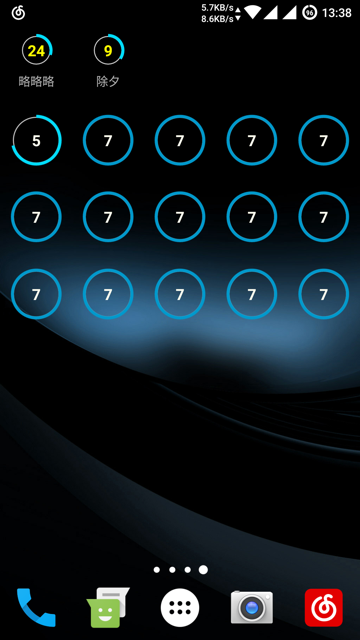

# 缘起

自己想要一个安卓上的倒计时小部件，找了一些现成的，发现没有我想要的`未来时间倒计时`功能，大意就是你可以设置一个倒计时的开始时间，（倒计时在开始时间那天才会开始计算倒计时），然后我就自己写了一个。

# 界面展示

## 桌面效果

就这么一个圆环的风格，正在进行的倒计时颜色偏亮

## 点击小部件之后显示的详情页面

### 还未开始的倒计时

### 正在进行中的倒计时

最下面有一个修改按钮，点击之后进入配置页面

## 小部件配置页面

可以设置开始、结束的日期，小标题以及详细内容，倒计时数字颜色，以及是否显示桌面小标题

### 日期设置

# 用法

从Github的[release](https://github.com/zhaohui8969/android_timer/releases)页面下载编译好的APK文件，直接安装，忽略那个安装之后在显示的应用图标吧（没啥用），向桌面小部件，小部件列表里有一个Week_timer，添加到桌面进入倒计时配置页面，Done。

